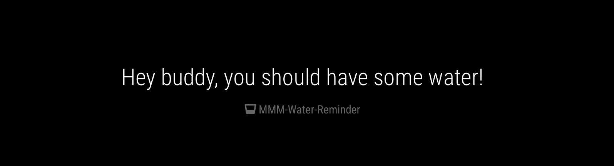

# MMM-WaterReminder []

WaterReminder Module for MagicMirror<sup>2</sup>

## Example

  


## Dependencies

* An installation of [MagicMirror<sup>2</sup>](https://github.com/MichMich/MagicMirror)

## Installation

* Clone this repo into `~/MagicMirror/modules` directory.
* Configure your `~/MagicMirror/config/config.js`:

```js
{
    module: 'MMM-WaterReminder',
    position: 'top_center',
    config: {
    	foo: "Hey buddy, you should have some water!",
        additionalPhrases: ["Beba água!"],
        alarm: {
			status: true, 
			src: "done-for-you.mp3",
            ...
        },
        ...
    }
}
```
